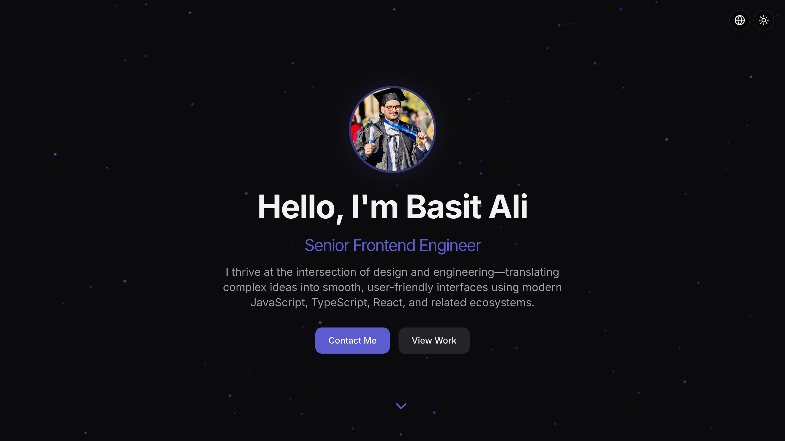

# 🌐 Portfolio 2.0



🚀 **Live Demo:** [Portfolio 2.0](https://basit-dev-de.github.io/portfolio-2/)

## 📌 Overview
**Portfolio 2.0** is a modern, visually appealing, and fully responsive personal website showcasing **Basit Ali’s** professional journey, skills, and projects. This interactive portfolio highlights expertise in **frontend development, automation, and AI-driven solutions**.

## ✨ Features
- ✅ **Dynamic Project Showcase** – Displays featured projects with live links.
- 🎨 **Modern & Responsive Design** – Optimized for mobile, tablet, and desktop.
- 🔍 **Tech Stack Overview** – Showcases expertise in cutting-edge technologies.
- 🌍 **Dark Mode & Light Mode** – Enhances user experience with theme switching.
- 🚀 **Built with React & TypeScript** – Ensuring performance and scalability.
- 🔥 **Animations & Smooth Transitions** – Enhances interactivity using Framer Motion.
- 🤖 **AI Agent Chatbot** – Integrated chatbot showcasing automation expertise.

## 🛠 Tech Stack


## 📦 Installation & Setup
Clone the repository and install dependencies:
```sh
git clone https://github.com/basit-dev-de/portfolio-2.git
cd portfolio-2
npm install
```

### 🚀 Run the Application
```sh
npm run dev
```

## 🤝 Contribution
Contributions are welcome! Feel free to fork the repo and submit a pull request.

## 📬 Connect with Me
- **GitHub:** [basit-dev-de](https://github.com/basit-dev-de)
- **Portfolio:** [Website](https://basit-dev.com)
- **Email:** [basit.ali@toptal.com](mailto:basit.ali@toptal.com)

🚀 **Explore my journey in frontend development with Portfolio 2.0!**
